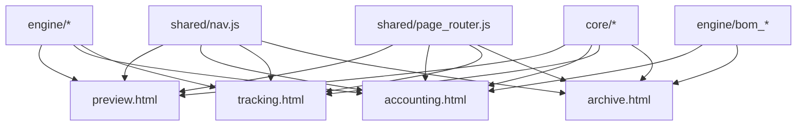

# 四页架构迁移指南 (Issue #13)

## 页面总览

| 页面 | 文件 | 职责 | 核心模块 |
|---|---|---|---|
| **预演** | `pages/preview.html` | 调参看利润 · 方案对比 | KPI + 状态控制 + 年度表 + 图表 |
| **核算** | `pages/accounting.html` | 内部报价 + 变更报价 | 成本拆解 + 线束利润 + 目标价 |
| **跟踪** | `pages/tracking.html` | 协议价落实 · 费用分摊 | 进度价差距 + 一次性 + 年降 + 呆滞 |
| **归档** | `pages/archive.html` | 数据存档管理 | 版本时间线 + Excel 查看 + 仓库浏览 |

## 共享基础设施

| 文件 | 职责 |
|---|---|
| `shared/nav.js` | 顶部导航栏（自动检测当前页、高亮、项目名称） |
| `shared/nav.css` | 导航栏样式（暗色主题、响应式） |
| `shared/page_router.js` | 跨页面状态传递（URL params + sessionStorage + BroadcastChannel） |

## 迁移步骤

### Phase A: 预演页（从 dashboard 砍掉非预演功能）

从 `dashboard.js` 提取以下渲染器到独立文件，供 `preview.html` 使用：

1. **KPI 网格渲染器** → `ui/renderers/kpi_grid.js`
   - `renderKpiGrid()`, `buildKpiCards()`
   - 6 个核心指标卡片：收入/成本/利润/毛利率/回收销量/资本回报

2. **状态控制面板** → `ui/state/scenario_state.js`
   - `renderStatePanel()`, `buildStateDropdowns()`
   - 8 个状态维度下拉框

3. **年度利润表渲染器** → `ui/renderers/annual_table.js`
   - `renderAnnualTable()`, `buildAnnualRows()`

4. **图表渲染器** → `ui/renderers/charts.js`
   - 成本桥图、因果链瀑布图、Shapley 归因图

5. **对比行渲染器** → `ui/renderers/compare_panel.js`
   - `renderCompareRows()`

### Phase B: 归档页（从 dashboard 移出 repo + workbook_viewer）

归档页已有独立模块：
- `ui/workbook_viewer.js` → 直接加载
- `ui/version_timeline.js` → 直接加载
- `core/repo.js` → 直接加载

需要从 `dashboard.js` 提取：
- 仓库文件浏览器 UI
- BOM 版本对比 UI

### Phase C: 核算页（新建报价核算工作台）

需要从 `dashboard.js` 提取：
1. 成本拆解表（按维度展开材料/人工/制造/包装/设备/R&D）
2. 线束级利润拆解（harness_profit 结果渲染）
3. 变更报价对比（BOM 变更影响 → 替换/新增/取消/呆滞）
4. 目标价求解 UI（target_price_solver 结果渲染）

### Phase D: 跟踪页（新建执行跟踪台）

需要从 `dashboard.js` 提取或新建：
1. 进度价差距追踪 UI（progress_price_tracker 结果渲染）
2. 连接器协议价落实 UI（connectorScenario.items 渲染）
3. 一次性费用分摊执行 UI（oneTimeCustomer.yearRows 渲染）
4. 年降执行追踪 UI（annualDrop.yearRows 渲染）
5. 残余材料池/呆滞 UI（residual_pool_handler 结果渲染）

## 依赖关系

## 注意事项

1. **状态同步**：预演页修改的状态组合需要能传递给核算页，通过 `page_router.js` 的 `navigateTo()` 方法
2. **Engine 按需加载**：归档页不需要完整计算引擎，只加载 BOM 相关模块
3. **CSS 复用**：通用样式继续复用 `dashboard.css`，各页面通过 `<style>` 补充特有样式
4. **渐进式迁移**：每个 Phase 可独立完成和测试，不阻塞其他 Phase
