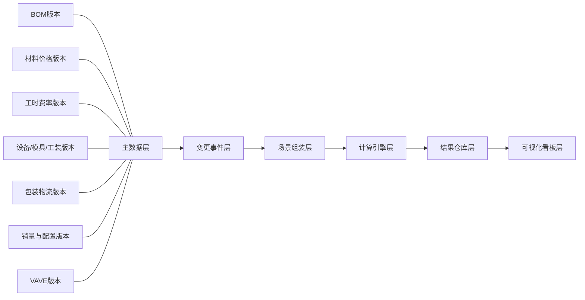

# G281 高压线束动态利润模型方案

## 1. 这本 Excel 现在是什么

我先把原始文件 `G281高压财务可行性分析-0107- 定点价格(2).xlsx` 复制为工作区内的 `source.xlsx` 做了结构解析。  
结论很明确：这不是一张单纯的报价表，而是一个已经半自动化的利润核算体系，包含了收入、BOM、工时、设备、模具、工装、研发、包装物流、配置销量和客户目标价等多个层级。

### 工作簿结构

共 18 个 sheet，核心分组如下：

| Sheet | 作用 | 在新系统里的位置 |
|---|---|---|
| `项目汇总` | 项目总览、利润汇总 | Dashboard 总览 |
| `项目评估汇总（昆山90%）` | 多年期汇总 | 年度情景汇总 |
| `项目评估汇总（昆山90%）-一个配置` | 单配置明细 | 单车型/单配置测算 |
| `客户报价逻辑` | 价格推导逻辑 | 定价引擎 |
| `运营工时费报价基准` | 工时费率基准 | 工时版本表 |
| `工厂效率` | 报价效率矩阵 | 效率规则表 |
| `设备投资明细` | 设备投入与摊销 | 设备版本表 |
| `项目专用模具` | 模具投入与生命周期摊销 | 模具版本表 |
| `项目工装投入` | 工装投入与摊销 | 工装版本表 |
| `研发费用` | 研发费用池 | 一次性费用池 |
| `包装物流费用` | 包装、运输、仓储 | 物流版本表 |
| `配置明细` | 销量结构、配置比例 | 配置/销量计划 |
| `KSK线束BOM明细` | 主 BOM | BOM 主版本表 |
| `二次物料明细` | 二次材料 | 二级物料表 |
| `总成散件清单` | 总成拆解 | 组件级 BOM |
| `配置清单` | 配置与年销量分配 | 配置计划表 |
| `客户目标价` | 目标价、到场价 | 价格梯度表 |
| `客户目标价 -初始` | 初始版本 | 初始基准版本 |

### 现有表里已经具备的能力

- 年度维度已经存在，覆盖 `2026-2031`
- 配置比例已经存在，不是单一销量假设
- BOM 中已经有价格类型字段，能看到 `系统价 / 分摊价 / 询价 / 批量价 / 总成参考价 / 散件`
- 已经把材料、人工、设备、包装物流拆成独立成本科目
- 目标价和到场价已经有基础链路

### 我扫到的关键数据质量问题

- `项目汇总!C21 / C22 / C24` 有 `#REF!`
- `项目评估汇总（昆山90%）-一个配置!Q11 / Q12 / Q39` 有 `#DIV/0!`
- `项目评估汇总（昆山90%）-一个配置!P42` 有 `#REF!`
- 公式里出现了 `_xlfn.ANCHORARRAY`，说明用了较新的 Excel 动态数组能力，兼容性风险比较高

这说明当前文件“能算”，但还没有形成稳定的、可维护的版本管理体系。

## 2. 当前 Excel 的真实问题

这张表最大的问题不是“少一个公式”，而是结构上没有把“主数据、版本、场景、结果”分开。

### 主要痛点

1. 修改方式偏手工，容易互相覆盖
2. 同一个 sheet 里混了参数、结果和解释说明
3. 变更没有事件记录，无法追溯是谁改了什么
4. 很多逻辑依赖单元格引用，容易断链
5. 情景切换不透明，缺少“基准版 vs 变更版”的差异展示
6. 一旦 BOM、铜铝价、工时、设备、物流同时变化，就很难判断利润波动来源

## 3. 推荐的系统架构

我建议把这个程序做成“五层结构”：



### 每层职责

#### 1) 主数据层
统一保存“不会因为一个场景变化就被覆盖”的基础对象。

- 零件主数据
- 车型/配置主数据
- 供应商主数据
- 工厂主数据
- 费用科目主数据

#### 2) 变更事件层
所有变化都不直接改旧数据，而是生成一个事件。

- `BOM_CHANGE`
- `EQUIPMENT_CHANGE`
- `VOLUME_CHANGE`
- `MATERIAL_PRICE_CHANGE`
- `CONNECTOR_PRICE_CHANGE`
- `LABOR_RATE_CHANGE`
- `PACKAGING_FREIGHT_CHANGE`
- `VAVE_CHANGE`

#### 3) 场景组装层
把某个时间点、某个版本、某个配置组合成一个可计算场景。

#### 4) 计算引擎层
执行公式，产出单套、单年、全生命周期利润。

#### 5) 结果仓库层
保存每次计算结果，支持对比、回溯、导出。

#### 6) 可视化看板层
把变化来源展示出来，不只是展示最终毛利。

## 4. 你要求的 7 类管理，应该怎么做

### 4.1 BOM 变更版本管理

目标不是保存“最新版 BOM”，而是保存“每个版本在什么时间有效”。

建议字段：

- `bom_version_id`
- `part_number`
- `effective_from`
- `effective_to`
- `change_reason`
- `change_owner`
- `approved_by`
- `status`

计算逻辑：

```text
材料成本 = Σ(用量 × 物料版本单价) + 损耗 + 二次物料 + 导线成本
```

显示方式：

- 版本树
- 版本差异高亮
- 单件成本变化瀑布图

### 4.2 设备资源变更管理

设备不是一次性“总金额”，而是要按生命周期量分摊。

建议字段：

- `equipment_id`
- `process_stage`
- `asset_type`
- `qty`
- `capex`
- `life_qty`
- `depreciation_method`
- `effective_version`

计算逻辑：

```text
单车设备分摊 = 设备总投入 / 生命周期产量
```

### 4.3 量纲变化管理

这里要管理三件事：

- 整车销量变化
- 各配置销售比例变化
- 回路/单件装车比例变化

建议把销量拆成两层：

- 年度总销量
- 配置 mix

计算逻辑：

```text
配置销量 = 年度总销量 × 配置占比
单年收入 = Σ(配置销量 × 配置单价)
```

### 4.4 铜基、铝基变化管理

这是高压线束利润波动最敏感的部分。

建议把材料拆成：

- 铜单价版本
- 铝单价版本
- 铜重
- 铝重
- 导线成本系数

计算逻辑：

```text
材料成本 = 铜重 × 铜价 + 铝重 × 铝价 + 非导线材料
```

建议做敏感性分析：

- 铜价 +5% / +10%
- 铝价 +5% / +10%
- 铜铝结构变化

### 4.5 连接器样品价、协议价、批量价管理

你这份 BOM 里已经有价格类型基础了，但还没做成可版本化规则。

建议的价格梯度：

- 样品价
- 协议价
- 批量价
- 年降价
- 特采价

建议字段：

- `supplier_id`
- `part_number`
- `price_stage`
- `price_type`
- `min_qty`
- `max_qty`
- `currency`
- `effective_date`
- `quote_no`

### 4.6 工时变更管理

工时变化要和工艺阶段一起管：

- 开线工时
- 公共制程工时
- 后工程工时
- 单班/双班效率

建议字段：

- `process_id`
- `work_content_seconds`
- `rate_per_hour`
- `efficiency_factor`
- `factory`
- `shift_mode`

计算逻辑：

```text
直接人工 = 工时 × 费率 × 效率修正
制造费用 = 工时 × 制造费率
```

### 4.7 包装运费变更管理

包装和物流不能只保留一个“固定值”，要拆到线路和包装形式。

建议字段：

- `pack_type`
- `inner_pack`
- `outer_pack`
- `freight_mode`
- `warehousing_fee`
- `third_party_warehouse_fee`
- `short_haul_fee`
- `effective_date`

### 4.8 其他 VAVE 管理

VAVE 应该独立成一张事件表，不要和 BOM 混在一起。

建议字段：

- `vave_id`
- `scope_type`
- `scope_id`
- `before_value`
- `after_value`
- `delta_value`
- `effective_version`
- `reason`
- `owner`

## 5. 建议的数据模型

我建议至少有这些核心表：

| 表名 | 用途 |
|---|---|
| `part_master` | 零件主数据 |
| `config_master` | 配置主数据 |
| `bom_version` | BOM 版本头 |
| `bom_item` | BOM 明细 |
| `material_price_version` | 铜/铝/辅料价格版本 |
| `connector_price_version` | 连接器价格阶梯 |
| `labor_rate_version` | 工时费率版本 |
| `equipment_version` | 设备投入及寿命 |
| `tooling_version` | 模具/工装版本 |
| `packaging_version` | 包装物流版本 |
| `volume_plan` | 年销量与 mix |
| `vave_event` | VAVE 事件 |
| `scenario_case` | 场景定义 |
| `calc_result` | 计算结果 |
| `change_log` | 审批与追溯日志 |

### 统一事件模型

所有变化建议统一成一张事件表，避免每个模块各搞一套。

```text
change_event(
  event_id,
  scope_type,
  scope_id,
  field_name,
  old_value,
  new_value,
  effective_from,
  version_no,
  scenario_id,
  status,
  reason,
  owner
)
```

这样做的好处是：

- 所有修改都可追踪
- 可以回滚到任意版本
- 很容易做“变更前 / 变更后”对比

## 6. 计算逻辑建议

建议把利润拆成 6 个子模块：

1. 收入
2. 材料成本
3. 人工成本
4. 制造费用
5. 固定资产摊销
6. 包装物流和 VAVE

### 总公式

```text
单套利润 = 到场收入 - 材料成本 - 人工成本 - 制造费用 - 设备/模具/工装摊销 - 研发费用摊销 - 包装物流 - VAVE影响 - 返点/返利
```

```text
年利润 = Σ(配置销量 × 单套利润)
```

```text
毛利率 = 利润 / 收入
```

### 分层计算

#### 1) 零件层
每个零件有自己的材料、工时、包装、供应商价格版本。

#### 2) 总成层
每个总成根据 BOM 聚合出成本。

#### 3) 配置层
配置 = 总成 × mix。

#### 4) 年度层
年度 = 配置 × 销量 × 年份。

#### 5) 生命周期层
整车生命周期利润 = 各年利润累加。

## 7. 可视化页面怎么做

我建议页面至少有 6 个：

### 1) 总览页

- 收入
- 总成本
- 毛利
- 毛利率
- 盈亏平衡点
- 关键变更提醒

### 2) 成本瀑布页

显示每次变更对利润的影响：

- BOM 变更
- 铜铝价格变化
- 工时变化
- 设备摊销变化
- 包装物流变化
- VAVE 抵减

### 3) 版本对比页

- 基准版
- 当前版
- 目标版
- 差异来源

### 4) 配置/销量页

- 年销量
- 配置 mix
- 单配置利润
- 单配置贡献度

### 5) 物料与价格页

- BOM 树
- 价格类型
- 铜/铝单价曲线
- 连接器价格阶梯

### 6) 生命周期页

- 2026 到 2031 年每年的收入、成本、利润
- 累计曲线
- 断点预警

## 8. MVP 建议

如果现在就做，我建议按这个顺序：

### Phase 1

- 把现有 Excel 里的主数据抽成统一结构
- 先解决 BOM、价格、销量、工时、物流几个核心表

### Phase 2

- 做版本管理
- 所有变更进入 `change_event`

### Phase 3

- 写计算引擎
- 输出单套、单年、生命周期利润

### Phase 4

- 做可视化看板
- 支持版本对比、瀑布图、敏感性分析

### Phase 5

- 加审批、导出、PDF、权限

## 9. 我对现有 Excel 的结论

这本表已经有一个可用雏形，但它更像“高级手工表”，还不是“动态利润模型程序”。

真正要升级成程序，关键不是多几个公式，而是把下面四件事做成系统能力：

1. 版本化
2. 事件化
3. 场景化
4. 可视化

只要这四件事做出来，BOM、工时、铜铝价、包装物流、设备摊销、VAVE 就能真正变成可维护的生命周期模型。

## 10. 下一步建议

如果你要继续，我建议下一步直接做下面两件事之一：

1. 我给你把这个方案落成一个可打开的 HTML 原型
2. 我先把这本 Excel 的主数据清洗成结构化 JSON / CSV，再接计算引擎

